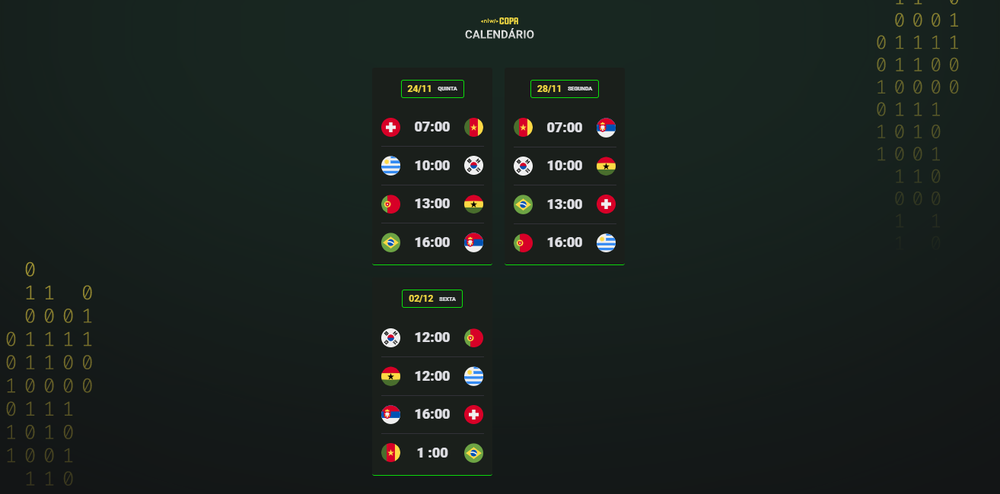

<h1 align="center"> NLW Copa </h1>

Evento exclusivo e gratuito, promovido pela Rocketseat para ensino de tecnologias WEB.

    <a href="#-tecnologias">Tecnologias</a>&nbsp;&nbsp;&nbsp;|&nbsp;&nbsp;&nbsp;
    <a href="#-projeto">Projeto</a>&nbsp;&nbsp;&nbsp;|&nbsp;&nbsp;&nbsp;
    <a href="#-layout">Layout</a>&nbsp;&nbsp;&nbsp;|&nbsp;&nbsp;&nbsp;
    <a href="#-licença">Licença</a>
    

    

 

    

## Tecnologias

Esse projeto foi desenvolvido com as seguintes tecnologias:

- HTML e CSS
- JavaScript
- Git e Github

## Projeto

O Calendário da Copa é um projeto que mostra os jogos do Brasil da Copa do mundo de futebol de 2022.

## Layout

Você pode visualizar o layout do projeto através [DESSE LINK] (https://www.figma.com/file/b5lpNDuRi4kYm5jPgTUP8p/Calend%C3%A1rio-de-Jogos-(Community)?node-id=172%3A179). É necessário ter conta no [Figma] (https://figma.com) para acessá-lo.

## :memo: Licença

Esse projeto está sob a licença MIT.